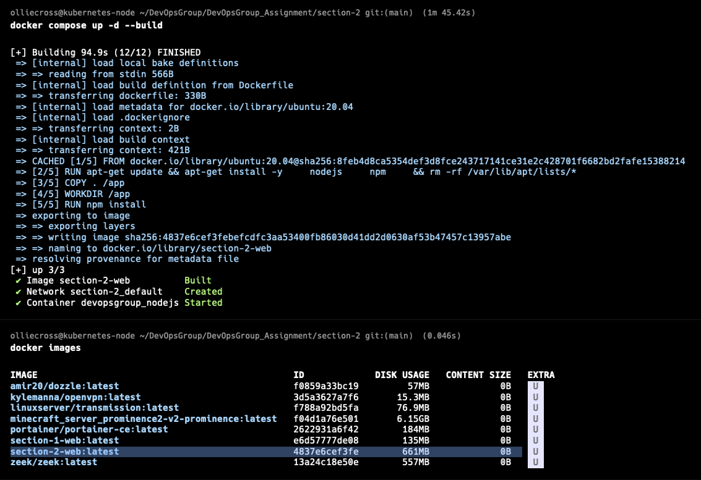
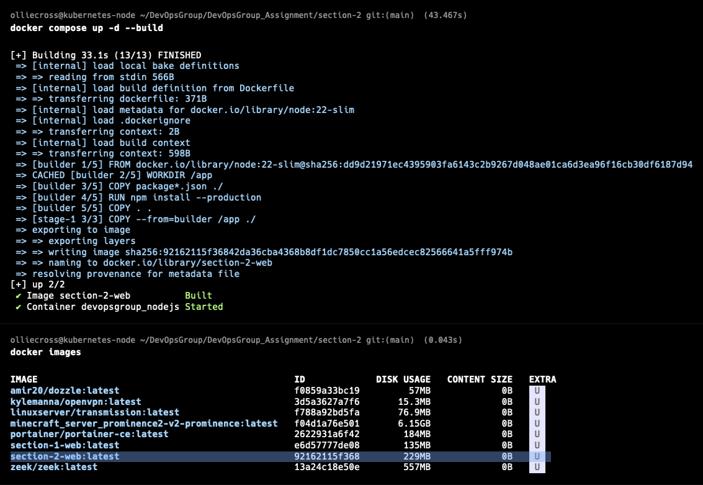

# Task C - Docker Build Fails (no space left on device)

#### pôvodný Dockerfile

``` Dockerfile
FROM ubuntu:20.04
RUN apt-get update && apt-get install -y nodejs npm
COPY . /app
WORKDIR /app
RUN npm install
CMD ["node","index.js"]
```

Pôvodný Dockerfile má niekoľko kritických nedostatkov, ktoré vedú k nadmernej spotrebe miesta na disku:

- Nevhodný základný image: Použitie plnohodnotného `ubuntu:20.04` pridáva stovky MB nepotrebných systémových knižníc.

- Akumulácia cache: Príkaz `apt-get update` bez následného čistenia `(rm -rf /var/lib/apt/lists/*)` zanecháva v image nepotrebné indexy balíkov.

- Chýbajúci `.dockerignore`: Ak sa kopíruje celý adresár `(COPY . /app)`, pravdepodobne sa kopírujú aj lokálne `node_modules`, čo nafukuje build kontext.

#### Dockerfile po optimalizácii

``` Dockerfile
# Stage 1.
FROM node:22-slim AS builder
COPY package*.json ./
RUN npm install --production
WORKDIR /app
COPY . .

# Stage 2.
FROM node:22-slim
WORKDIR /app
COPY --from=builder /app/node_modules ./node_modules
COPY --from=builder /app .
EXPOSE 3000
USER node
CMD ["node", "index.js"]
```

- Predpokladame, že zdrojový adresár obsahuje aj `package.json` pre úspešne spustenie `npm install`.
- Zmenšenie veľkosti: Prechodom z Ubuntu na `node:slim` sa veľkosť image výrazne zníži.
- Efektívna cache: Tým, že `COPY package*.json` je pred `COPY . .`, Docker nemusí znova inštalovať moduly pri každej zmene v zdrojovom kóde (pokým sa nezmenia závislosti).
- Čistenie disku: Multi-stage build automaticky zahodí všetky dočasné súbory z prvej fázy, čím predchádza chybe "no space left on device".
- Bezpečnosť: Finálny image neobsahuje nástroje ako `apt`, `curl` alebo `gcc`, čo zmenšuje možnosti pre potenciálny útok a zvyšuje tak bezpečnosť.

#### Veľkosť pôvodného imageu
661MB, 1m 45s deploy time


#### Veľkosť optimalizovaného imageu
229MB, 43s deploy time


#### Monitoring
